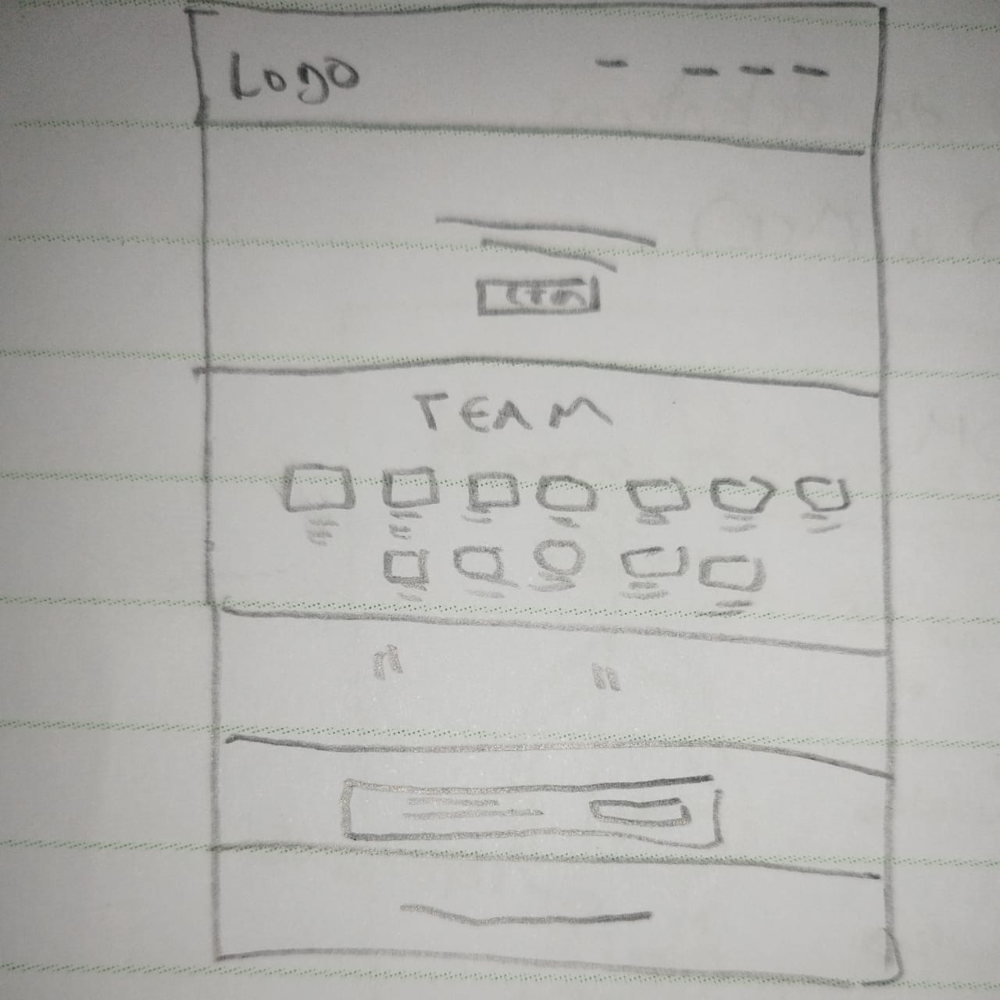
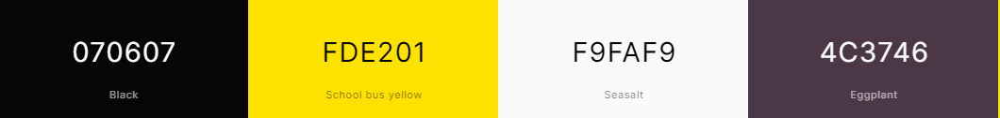
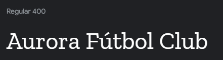

# Aurora Fútbol Club landing page redesign exercise
This is a landing page redesign of the "Aurora Fútbol Club", a Guatemala football club landing page.

Aclaration: This is not an oficial landing page in any way related to the oficial club, the landing page is just and exercise of design and elaboration of a landing page.

# The proces
Also, I will like to record the process, so here we will find some of that. Starting with the sketch made to arganice the project.

## The sketch

This sketch shows the basics of the landing page, with a hero section, information about the players a qoute that represents the team values, a call to action to buying tickets and a basic footer.

## The colors
Using inspiration from the team logo, that in my opinions needs its own redesign to adapt to modern standards, and the help of avaible tools, the colors used will be the following:

## The font
The font used is the stylish and professional Zilla Slab Regular 400
